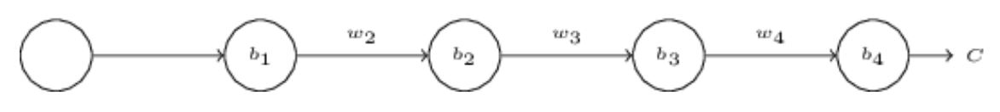
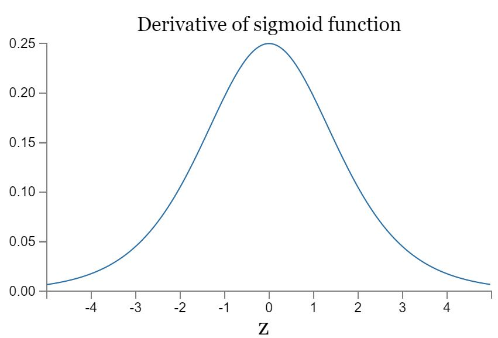
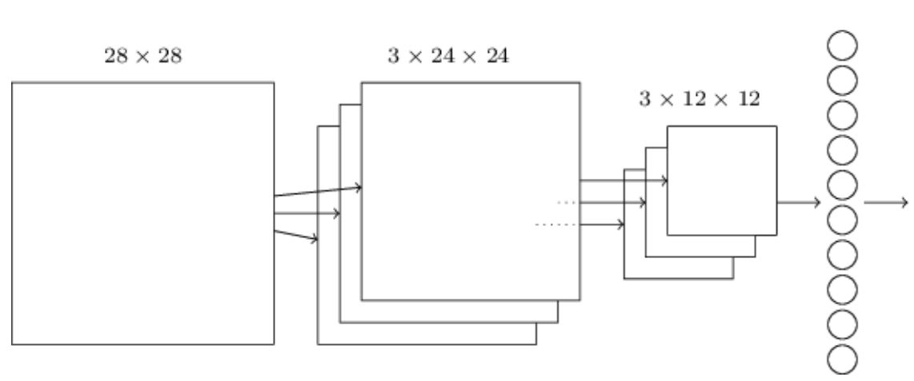

# 手写体识别-深度学习

## 问题：为什么深度神经网络难以训练

1. 梯度消失（以及梯度爆炸）问题，又称梯度不稳定问题
2. 最后一层隐藏层过早饱和

### 梯度消失（以及梯度爆炸）问题。

1. 什么是梯度消失问题？

   当有多层隐藏层，前面的隐藏层学习速度比后面的隐藏层慢

2. 为什么会出现梯度消失问题？

   举例来说，有如下图的神经网络

   

   因为$\frac{\partial C}{\partial w}$和$\frac{\partial C}{\partial b}$类似，故以$\frac{\partial C}{\partial b}$举例。
   $$
   \begin{eqnarray}
   \frac{\partial C}{\partial b_1} = \sigma'(z_1) \, w_2 \sigma'(z_2) \,
    w_3 \sigma'(z_3) \, w_4 \sigma'(z_4) \, \frac{\partial C}{\partial a_4}.
   \end{eqnarray}
   $$
   $\sigma'$的图像如图

   

   $(\sigma')_{max} = \sigma'(0) = \frac{1}{4}$，如果用均值为0，标准差为1的高斯分布函数初始化权重，则有$|w_j| < 1$，故有$|w_j \sigma'(z_j)| < \frac{1}{4}$，因此相比较于$\frac{\partial C}{\partial b_3}，\frac{\partial C}{\partial b_1}$**至少缩小1/16**，也就是梯度消失产生的原因。

3. 为什么会出现梯度爆炸问题？

   如果权重不是用高斯分布函数初始化的，比如说$w_1 = w_2 = w_3 = w_4 = 100$，选择b使得$z_j = 0$。在这些条件下，有$w_j \sigma'(z_j) = 25$，相较于 $\frac{\partial C}{\partial b_3}，\frac{\partial C}{\partial b_1}$**扩大了25*25倍**，也就是梯度爆炸产生的原因。

## 卷积网络

三个概念：local receptive fields, shared weights, and pooling

### local receptive fields

> Each neuron in the first hidden layer will be connected to a small region of the input neurons, for example, a 5×5 region, corresponding to 25 input pixels.

如图如果输入图像是28×28，以5×5作为local receptive fields，移动步长为1像素，则第一隐藏层有24×24个神经元

**注**：步长可以为其他（如2像素）

### shared weights and biases

输入层到隐藏层的映射称为feature map，feature map 的权重称为shared weights，feature map的偏置称为shared bias。shared weights and bias也被称为kernal or filter。

一个feature map 只能观测一个局部特征，因此一个卷积层包含几个不同的feature maps。假设一个feature map 为5×5，有20个feature map，则卷积层有$(5*5+1)*20=520$个参数

### pooling layers

pooling紧跟卷积层，用来**简化卷积层的输出**

pooling技术有多种(max-pooling, L2 pooling)，max-pooling(即在2×2的神经元中选择最大的激活值作为pooling unit)。图中卷积层有24×24个神经元，经过pooling后有12×12个神经元。

### 总结

> We can think of max-pooling as a way for the network to ask whether a given feature is found anywhere in a region of the image. The intuition is that once a feature has been found, its exact location isn't as important as its rough location relative to other features. A big benefit is that there are many fewer pooled(合并的) features, and so this helps reduce the number of parameters needed in later layers.

输出层和pooling-layer是全连接的（即pooling-layer中每个神经元都与输出层的10个神经元连接）。

#### 如何理解在convolutional-pooling 层后再加第二层convolutional-pooling 

> You can think of the second convolutional-pooling layer as having as input 12×12 "images", whose "pixels" represent the presence (or absence) of particular localized features in the original input image. That version is abstracted and condensed, but still has a lot of spatial structure, and so it makes sense to use a second convolutional-pooling layer.

## 卷积神经网络的使用

[Convolutional neural networks in practice](http://neuralnetworksanddeeplearning.com/chap6.html#convolutional_neural_networks_in_practice)

如何精益求精？

1. using rectified linear units
2. Expanding the training data
3. Inserting an extra fully-connected layer and using dropout technique 
4. Using an ensemble of networks

[手写体识别的精益求精快速入口](http://neuralnetworksanddeeplearning.com/chap6.html#problem_834310)

## 其他神经网络

1. RNNs：语音识别和自然语言处理
2. Long short-term memory units(LSTMs)：用于解决RNN中的**梯度不稳定**问题
3. 深度信念网络(deep belief nets)、生成模型、Boltzmann machines：它的生成模型使DBN表现得像人类一样（对于手写体识别来说，不仅能识别数字，也能写数字）；它能进行无监督学习和半监督学习

## 补充资料

[Visualizing and Understanding Convolutional Networks](http://arxiv.org/abs/1311.2901) by Matthew Zeiler and Rob Fergus (2013).

## 参考资料

[neuralnetworksanddeeplearning](http://neuralnetworksanddeeplearning.com/chap6.html)