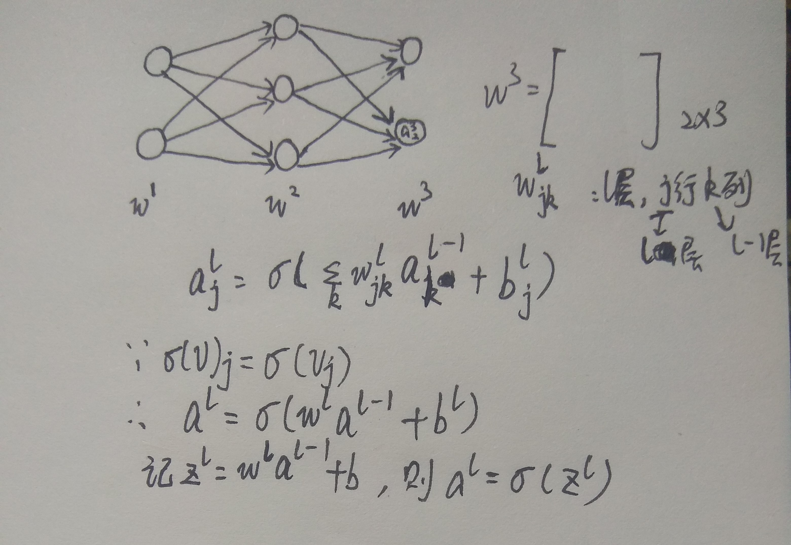
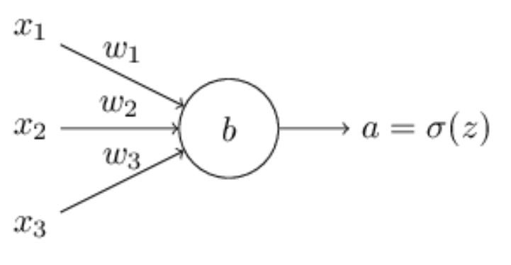

# 神经网络之手写体识别

## 偏置结点由来

对于一个神经元，
$$
\begin{eqnarray}
  \mbox{output} = \left\{ 
    \begin{array}{ll} 
      0 & \mbox{if } \sum_{i}w_ix_i \leq threshold \\
      1 & \mbox{if } \sum_{i}w_ix_i > threshold
    \end{array}
  \right.
\tag{1}\end{eqnarray}
$$
将$\sum_i w_ix_i$改成向量点乘，让b恒等于-threshold，则(1)式转化为(2)式
$$
\begin{eqnarray}
  \mbox{output} = \left\{ 
    \begin{array}{ll} 
      0 & \mbox{if } w\cdot x + b \leq 0 \\
      1 & \mbox{if } w\cdot x + b > 0
    \end{array}
  \right.
\tag{2}\end{eqnarray}
$$

## 为何使用sigmoid激活函数

**问题**：(2)式中要想改变输出则需要改变w和b，但稍微改变一下，可能就让输出从0跃变到1.当我们有多个输出时，将其中一个输出调整正确后，其他输出的变化不可控（即可能从0跃变为1）.

sigmoid：用于解决上面的问题。**即w和b微小的改变不会导致输出跃变**

## 问题

1. 为何输出层是10个神经元，而不是4个神经元（用二分法，4个神经元能识别10个数字，因为2^4=16）？

   如果用4个神经元，则每个神经元必须决定数字的最重要部分是什么，而这种算法很难想象（虽然也许某天能发现该算法）

2. 为何不直接最大化数字，而是选择最小化平方误差？

   [代价函数](#代价函数)

   在神经网络中`直接最大化w和b`并不是一个平滑函数，也就是说略微改变w和b可能不会改变精确度，因此很难决定如何改变w和b以提高性能。而平方误差函数是平滑的。平滑函数意味着略微改变w和b会导致输出略微变化。

3. 神经网络的每一层在做什么？（理解神经网络）

   举例来说，识别图像中是否存在人脸。将该**问题拆分**为子问题，包括左上部分是否有眼睛、右上部分是否有眼睛、中间是否有鼻子、鼻子下是否有嘴巴等。而要回答这些问题，可将**问题进一步拆分**，如对于左上部分是否有眼睛这一问题，可拆分为是否有睫毛、是否有眼球、是否有虹膜等问题。当一步步回答完子问题后，也就能回答父问题了，最终可得到结果。神经网络可用这个例子进行理解。

## 神经网络结构图

## 代价函数

**注：a是计算出来的，而y(x)是样本的真实标记（平常我使用的是y(x)是计算出来的，而a是真实标记）**
$$
\begin{eqnarray}  C(w,b) \equiv
  \frac{1}{2n} \sum_x \| y(x) - a^{L}(x)\|^2
\end{eqnarray}
$$

有时可省略$\frac{1}{n}$而计算总的代价，如实时生成数据的情况

### 解释梯度下降

设代价函数为C(v1,v2)，则
$$
\begin{eqnarray} 
  \Delta C \approx \frac{\partial C}{\partial v_1} \Delta v_1 +
  \frac{\partial C}{\partial v_2} \Delta v_2
  = \nabla C \cdot \Delta v
\end{eqnarray}
$$
通过选择$\Delta v$使$\Delta C$为负数，假设选择$\Delta v = - \eta \Delta C，\eta为小整数$，故$\Delta C \approx -\eta \|\Delta C \|^2$，因此C只能减小。

根据以上可得
$$
v \rightarrow v' = v -\eta \nabla C
$$

### mini-batch算法原理

$\nabla C = \frac{\sum_x \nabla C_x}{n}$，此情况下当训练样本很多时所用时间长。故提出mini-batch方法

1. 训练集中随机取m个样本X1, X2, ..., Xm
2. 当m足够大时，有$\frac{\sum_{j=1}^m \nabla C_{X_{j}}}{m} \approx \frac{\sum_x \nabla C_x}{n} = \nabla C$
3. $w_k  \rightarrow  w_k' = w_k-\frac{\eta}{m}
     \sum_j \frac{\partial C_{X_j}}{\partial w_k}$,
4. $b_l  \rightarrow  b_l' = b_l-\frac{\eta}{m}
     \sum_j \frac{\partial C_{X_j}}{\partial b_l}$

**注意**：$\frac{1}{m}$可以省略，因为有$\eta$的存在，即将$\frac{\eta}{m}$看成学习步长

## 反向传播算法

### 四个公式

1. $\delta^L_j = \frac{\partial C}{\partial a^L_j} \sigma'(z^L_j) \tag{BP1}$
2. $\delta^l = ((w^{l+1})^T \delta^{l+1}) \odot \sigma'(z^l) \tag{BP2}$
3. $\frac{\partial C}{\partial b^l_j} = \delta^l_j \tag{BP3}$
4. $\frac{\partial C}{\partial w^l_{jk}} = a^{l-1}_k \delta^l_j\tag{BP4} $

### 补充

$\odot的使用$

for example, 
$$
\begin{eqnarray}
\left[\begin{array}{c} 1 \\ 2 \end{array}\right] 
  \odot \left[\begin{array}{c} 3 \\ 4\end{array} \right]
= \left[ \begin{array}{c} 1 * 3 \\ 2 * 4 \end{array} \right]
= \left[ \begin{array}{c} 3 \\ 8 \end{array} \right].
\end{eqnarray}
$$

1. 对于(BP1)，有$\delta^L_j = \frac{\partial C}{\partial a^L_j} (a^L_j)' = \frac{\partial C}{\partial a^L_j} \sigma'(z^L_j) = (a^L_j - y_j) \odot \sigma'(z^L_j)$，矩阵形式为$\delta^L = \nabla_a C \odot \sigma'(z^L) $
2. 对于(BP3)，有$\frac{\partial C}{\partial b} = \delta $
3. 对于(BP4)，矩阵形式：$\frac{\partial C}{\partial w} = a_{in} \odot \delta_{out}$，$a_{in}$表示权重线的起点，$\sigma_{out}$表示终点。如果$a_{in} \approx 0$则神经元学习慢（**哪个神经元？起点还是终点？**应该是起点）
4. 对于(BP1)中的$\sigma(z^L_j)$，当它接近0或1时，函数变得非常平滑，故此时$\sigma'(z^L_j) \approx 0$，输出神经元学习慢
5. 对于(BP2)中的$\sigma(z^L_j)$，类似的，输出入神经元学习慢
6. [证明](#公式证明)

## 神经网络的改进

1. [选择其他的代价函数，如交叉熵代价函数](#交叉熵代价函数)
2. [3个正则化方法](#正则化)
3. [权重初始化](#权重初始化)
4. [代替梯度下降的算法](#代替梯度下降的算法)
5. [代替sigmoid的激活函数](#代替sigmoid的激活函数)

### 交叉熵代价函数

#### 为什么要提出该代价函数？

**sigmoid激活函数**、代价函数为**平方差函数**时，有一个**奇怪的现象**：当初始误差很大时，它初始的学习速度很慢（代价函数值降低缓慢），当算法执行多次后学习速度才会迅速提高；而当初始误差较大，却能让代价函数值迅速降低。**原因**是：改变w和b的值是由代价函数的偏导数决定，故学习速度慢就是说偏导数小，$\frac{\partial C}{\partial w}$和$\frac{\partial C}{\partial b}$都与$\delta$有关，而$\delta$又与$\sigma$的导数有关，在1和0附近sigmoid函数很平缓（误差大说明在1和0附近），因而出现上面的奇怪现象。为解决学习速度慢的问题，故提出用交叉熵函数替换平方差函数。**注**：它解决了输出层神经元的“饱和”问题，但无法解决隐藏层神经元的“饱和”问题，根据BP2可知。

#### 为什么交叉熵函数可以用作代价函数?

代价函数需要满足两个条件：1. C总是非负的 2. 当实际输出与期望输出接近时，代价应接近于0。显然交叉熵函数满足以上两个条件。此外，它解决了学习速度慢的问题。

单神经元交叉熵代价函数
$$
C = -\frac{1}{n} \sum_x \left[y \ln a + (1-y ) \ln (1-a) \right]
$$

对于如上图神经元，有
$$
\begin{eqnarray}
  \frac{\partial C}{\partial w_j} & = & -\frac{1}{n} \sum_x \left(
    \frac{y}{\sigma(z)} \frac{\partial \sigma(z)}{\partial w_j} +\frac{(1-y)}{1-\sigma(z)} \cdot (-1) \cdot \frac{\partial \sigma(z)}{\partial w_j} \right)
\\
& = & -\frac{1}{n} \sum_x \left(
    \frac{y}{\sigma(z)} -\frac{(1-y)}{1-\sigma(z)} \right)
  \frac{\partial \sigma}{\partial w_j} 
\\
 & = & -\frac{1}{n} \sum_x \left( 
    \frac{y}{\sigma(z)} 
    -\frac{(1-y)}{1-\sigma(z)} \right)\sigma'(z) x_j.
\\
& = & \frac{1}{n}
  \sum_x x_j(\sigma(z)-y)
\tag{1}\end{eqnarray}
$$

$$
\begin{eqnarray}
  \frac{\partial C}{\partial b} & = & -\frac{1}{n} \sum_x \left(
    \frac{y}{\sigma(z)} -\frac{(1-y)}{1-\sigma(z)} \right)
  \frac{\partial \sigma}{\partial b} 
\\
  & = & \frac{1}{n} \sum_x \left( \sigma(z) - y \right)
\tag{2}\end{eqnarray}
$$

#### 何时用交叉熵函数取代平方差函数？

几乎所有情况下都应选择交叉熵函数。只有在激活函数没有使用时（即$a^L_j = z^L_j$ ），平方差函数是很好的选择。此时$\delta^L = a^L - y$，有
$$
\begin{eqnarray}
      \frac{\partial C}{\partial w^L_{jk}} & = & \frac{1}{n} \sum_x 
      a^{L-1}_k  (a^L_j-y_j) \tag{3}\\
      \frac{\partial C}{\partial b^L_{j}} & = & \frac{1}{n} \sum_x 
      (a^L_j-y_j) \tag{4}
\end{eqnarray}
$$
式(3)、(4)同时也是多层多个神经元、使用交叉熵后的式子

多层神经网络的交叉熵
$$
\begin{eqnarray}  C = -\frac{1}{n} \sum_x
  \sum_j \left[y_j \ln a^L_j + (1-y_j) \ln (1-a^L_j) \right].
\end{eqnarray}
$$

#### 交叉熵函数是如何想出来的？

[交叉熵函数来自哪](http://neuralnetworksanddeeplearning.com/chap3.html#what_does_the_cross-entropy_mean_where_does_it_come_from)

### softmax和log-likelihood

激活函数为softmax，代价函数为log-likelihood

#### 激活函数

$$
a^L_j = \frac{e^{z^L_j}}{\sum_k e^{z^L_k}}
$$

其中$z^L_j = \sum_k w^L_{jk} a^{L-1}_k + b^L_j$，分母为该层所有神经元的输出之和。可将其看成概率分布，因为$\sum_j a^L_j = \frac{\sum_j e^{z^L_j}}{\sum_k e^{z^L_k}} = 1$。当其中一个输出增大，另外的输出都减小

#### 代价函数

$$
C = -ln a^L_y
$$

有下面两个式子（暂时证不了）
$$
\begin{eqnarray}
  \frac{\partial C}{\partial b^L_j} & = & a^L_j-y_j \\
  \frac{\partial C}{\partial w^L_{jk}} & = & a^{L-1}_k (a^L_j-y_j) 
\end{eqnarray}
$$

#### 选择交叉熵那套还是softmax这套工具？

当输出值是概率时，softmax+log-likelihood是很好的选择，另外对于分类问题也值得使用。

### 正则化

$$
C = C_0 + \frac{\lambda}{2n} \sum_w w^2
$$

其中$C_0$为未正则化的代价函数。

用SGD，有
$$
\begin{eqnarray} 
  \frac{\partial C}{\partial w} & = & \frac{1}{m} \sum_x \frac{\partial C_x}{\partial w} + 
  \frac{\lambda}{n} w \\ 
  \frac{\partial C}{\partial b} & = & \frac{1}{m} \sum_x \frac{\partial C_x}{\partial b}.
\end{eqnarray}
$$
其中$C_x$表示mini-batch中的每个样本的代价，故有
$$
\begin{eqnarray}
b & \rightarrow & b -\frac{\eta}{m} \sum_x \frac{\partial C_x}{\partial b} \\

w & \rightarrow & w-\frac{\eta}{m} \sum_x \frac{\partial C_x}{\partial w}-\frac{\eta \lambda}{n} w \\
& = & (1-\frac{\eta \lambda}{n})w - \frac{\eta}{m} \sum_x \frac{\partial C_x}{\partial w}
\end{eqnarray}
$$
**注意**：上式中w不一定一直向0靠近，当不向0靠近时能减小$C_0$的值($\lambda$很小时)。

#### 正则化的优点

- 抑制过拟合
- 未正则化容易陷入局部最优解，故要运行多次选择最合适的解；而正则化运行次数不用很多，因为它的最优解很容易复现（即多次运行都是相同的解）

#### 正则化种类

- L2正则化（上面所写的）。权重收缩到一个与w成比例的数
- L1正则化。权重在向0靠近的过程中，收缩到一个常数
- dropout

### 权重初始化

当使用均值为0，标准差为1的高斯分布来初始化权重时，隐藏层的神经元容易“饱和”；通过使用均值为0，标准差为$\frac{1}{\sqrt{n_{in}}}$的高斯分布来初始化权重，可解决上述问题($n_{in}$表示输入层神经元个数，也就是特征个数)，而这个方法也能缓解梯度消失和爆炸问题。使用tanh激活函数，使用$\frac{1}{\sqrt{n_{in}}}$；使用ReLU激活函数，使用$\frac{2}{\sqrt{n_{in}}}$。

### 代替梯度下降的算法

- Hessian technique

  1. 相比于SGD，它能更快收敛，避免SGD中的一些异常状况
  2. 计算消耗的资源过多

- momentum technique

  综合SGD和Hessian的优点。经常被使用

### 代替sigmoid的激活函数

- tanh(z)：$tanh(z) = \frac{e^z - e^{-z}}{e^z + e^{-z}}$，$\sigma(z) = \frac{1+tanh(\frac{z}{2})}{2}$。某些时候会比sigmoid好一些，因为在sigmoid中，一次循环中所有的权重要不都增加，要不都减小（a是正数，则w的符号取决于 $\delta​$）；而tanh则允许一次循环中有的权重增加，有的权重减小。
- ReLU：max(0, wx+b)。ReLU比sigmoid和tanh会更好，**可能的原因**在于**增大输入的权重不会让神经元饱和**，而当z为负数时停止学习。

## 补充资料

### 公式证明

定义：$\delta^L_j = \frac{\partial C}{\partial z^L_j}$。**使用计算图来进行推导**(吴恩达，神经网络和深度学习，第二周，计算图的导数计算)

#### BP1证明

$$
\delta^L_j = \sum_k \frac{\partial C}{\partial a^L_k} \frac{\partial a^L_k}{\partial z^L_j}
$$

$a^L_j = \sigma(z^L_j)$，当k!=j时，$\frac{\partial a^L_k}{\partial z^L_j}$等于0，故有
$$
\delta^L_j = \frac{\partial C}{\partial a^L_j} \sigma'(z^L_j)
$$

#### BP2证明

$$
\begin{eqnarray}
  \delta^l_j & = & \frac{\partial C}{\partial z^l_j} \\
  & = & \sum_k \frac{\partial C}{\partial z^{l+1}_k} \frac{\partial z^{l+1}_k}{\partial z^l_j} \\ 
  & = & \sum_k \frac{\partial z^{l+1}_k}{\partial z^l_j} \delta^{l+1}_k
\end{eqnarray}
$$

有$z^{l+1}_k = \sum_j w^{l+1}_{kj} a^l_j +b^{l+1}_k = \sum_j w^{l+1}_{kj} \sigma(z^l_j) +b^{l+1}_k$

故可得到$\frac{\partial z^{l+1}_k}{\partial z^l_j} = w^{l+1}_{kj} \sigma'(z^l_j)$，代入可得
$$
\delta^l_j = \sum_k w^{l+1}_{kj} \delta^{l+1}_k \sigma'(z^l_j)
$$

#### BP3证明

$$
\frac{\partial C}{\partial b^l_j} = \frac{\partial C}{\partial z^l_j} \frac{\partial z^l_j}{\partial b^l_j}
$$

有$z^l_j = \sum_k w^l_{jk} \sigma(z^{l-1}_k) + b^l_j$

故可得$\frac{\partial C}{\partial b^l_j} = \delta^l_j$

#### BP4证明

$$
\frac{\partial C}{\partial w^l_{jk}} = \frac{\partial C}{\partial z^l_j} \frac{\partial z^l_j}{\partial w^l_{jk}}
$$

有$z^l_j = \sum_k w^l_{jk} \sigma(z^{l-1}_k) + b^l_j$

故可得$\frac{\partial C}{\partial w^l_{jk}} = \delta^l_j \sigma(z^{l-1}_k) = \delta^l_j a^{l-1}_k$

### 增加训练样本的方法

对于手写体识别，将图片旋转一定角度（不能是任意大的角度，因为这和现实世界不符，人不会写出倒立的5等）即可增加一个训练样本。也可歪斜图片，还有其他方法，参看

[Best Practices for Convolutional Neural Networks Applied to Visual Document Analysis](http://dx.doi.org/10.1109/ICDAR.2003.1227801), by Patrice Simard, Dave Steinkraus, and John Platt (2003).

对于其他的数据增加样本的方法：

> The general principle is to expand the training data by applying operations that reflect real-world variation. It's not difficult to think of ways of doing this. Suppose, for example, that you're building a neural network to do speech recognition. We humans can recognize speech even in the presence of distortions such as background noise. And so you can expand your data by adding background noise. We can also recognize speech if it's sped up or slowed down. So that's another way we can expand the training data. These techniques are not always used - for instance, instead of expanding the training data by adding noise, it may well be more efficient to clean up the input to the network by first applying a noise reduction filter. 

## 小技巧

- 机器学习算法A和B，哪个算法更好，其实取决于所使用的数据集。数据集和算法都是我们需要关注的内容

- 如何设置算法中的参数值？

  - 如果训练样本巨多，则可以随机取出一部分来用作调整算法中的某些值（在神经网络中，如$\eta, \lambda,  mini-batch size$），但不使用其他样本，调整完后可以用所有样本进行训练。

  - 学习步长$\eta$策略

    选择一个开始的$\eta$，如果随着循环进行代价函数降低，则慢慢扩大$\eta$重新运行（如扩大10倍），直到发现代价函数出现振荡或上升；反之则缩小$\eta$。**注**：当然也可以用验证集精度的提升来选择$\eta$

    **值得注意的是**：当在数量级不同的区间中随机选取步长时，最好用对数的方式选取（如[0.1, 1] 中选取步长，若直接随机选取，则90%在[0, 1] 之间，10%在[0.1, 0]之间；若用对数方式，即在[-1, 0]之间随机选取x，然后用10^x作为步长，这是合理的）

  - 使用早停

    在某次循环之后，再经过多次循环（如10次）后精度没有上升，则选择停止。**注**：如果想找到最佳精度的循环次数，则不要用早停；对于这种情况，开始可用no-improvement-in-ten，然后再用其他策略，如no-improvement-in-twenty, no-improvement-in-fifty, and so on. 

  - $\eta$的调整

    训练循环开始时可以设置较大的$\eta$，当多轮循环过后，则减小$\eta$

  - $\lambda$选择

    开始让$\lambda=0$，当选择好$\eta$后，令$\lambda=1$，根据验证集精度来增加或减少$\lambda$（倍数）。当找到合适的$\lambda$时，再微调$\lambda$的值以选取更好的$\lambda$

  - mini-batch size

    > Too small, and you don't get to take full advantage of the benefits of good matrix libraries optimized for fast hardware. Too large and you're simply not updating your weights often enough. 

    由于mbs独立于其他参数（除了神经网络的结构），因此可直接选择一个较合适的值，再根据验证集精度慢慢调整就是了

  - 神经网络和深度学习参数选择的推荐文章：

    1. [Practical recommendations for gradient-based training of deep architectures](http://arxiv.org/abs/1206.5533), by Yoshua Bengio (2012).
    2. [Efficient BackProp](http://yann.lecun.com/exdb/publis/pdf/lecun-98b.pdf), by Yann LeCun, Léon Bottou, Genevieve Orr and Klaus-Robert Müller (1998)
    3. [Neural Networks: Tricks of the Trade](http://www.springer.com/computer/theoretical+computer+science/book/978-3-642-35288-1), edited by Grégoire Montavon, Geneviève Orr, and Klaus-Robert Müller. （该书中包括了前两篇的技巧）
    4. [how to choose a neural network's hyper-parameters](http://neuralnetworksanddeeplearning.com/chap3.html#how_to_choose_a_neural_network's_hyper-parameters)

## 参考资料

[neuralnetworksanddeeplearning](http://neuralnetworksanddeeplearning.com)

