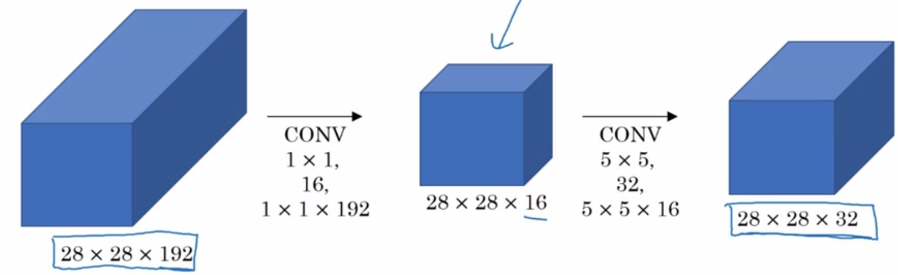
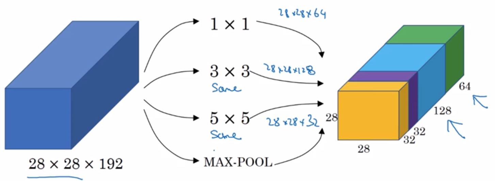

# 卷积网络

## filter

可通过filter进行垂直边缘检测和水平边缘检测

## 默认卷积的问题

- 每经过一次卷积，输出就缩小一圈（6x6的图像变成4x4的图像，再变成2x2的图像）
- 边缘卷积的次数少，丢失了边缘特征（左上角的一个像素只卷积了一次，而中间的像素能卷积多次）

### 解决方案：padding

在原图像周围padding p个像素（一般用0填充，从6x6的图像变成8x8的图像），这样卷积过后仍旧是6x6的图像，且边缘特征也没有丢失

valid卷积：不作padding； same卷积：作padding使输入和输出图像的size一样

## 标记总结

### 网络示例

6\*6\*3通过两个3\*3\*3变成4\*4\*2，计算方式为对应的层卷积然后相加得到结果的对应处的一个数字

If layer l is a convolution layer, input is $n_H^{[l-1]} * n_W^{[l-1]} * n_c^{[l-1]}$, output is $n_H^{[l]} * n_W^{[l]} * n_c^{l}$ , 则有，

$f^{[l]} = filter\ size$, filter为$f^{[l]} * f^{[l]} * n_c^{[l-1]}$

$p^{[l]} = padding$

$s^{[l]} = stride$

$n_c^{[l]} = number \ of \ filters$

$n_H^{[l]} = \lfloor \frac{n_H^{[l-1]} + 2p^{l} - f^{[l]}}{s^{[l]}} + 1 \rfloor, n_W^{[l]}同理$

激活值： $a^{[l]} = n_H^{[l]} * n_W^{[l]} * n_c^{l}$ , 当使用mini-batch时，$A^{[l]} = m * n_H^{[l]} * n_W^{[l]} * n_c^{l}$

权重：$f^{[l]} * f^{[l]} * n_c^{[l-1]} * n_c^{[l]}$

偏差：$1*1*1*n_c^{[l]}$

对于上图的例子：$f^{[l]} = 3 * 3 * 3$，$p^{[l]} = 0$， $s^{[l]} = 1$，$n_c^{[l]} = 2$，$n_H^{[l]} = (6+2*0-3)/1 + 1 = 4$

## 使用卷积的理由

- 参数共享：特征提取器可能在多处发挥作用（如垂直边缘提取器，在同一幅图中可以有多个垂直边缘，因而垂直边缘提取器可以多次发挥作用）
- 稀疏连接：每层的每一个输出值只与一小部分的输入值有关

## 论文阅读

卷积神经网络——第二周——2.2经典网络

## Inception网络

**1×1卷积**

作用：为神经网络添加一个非线性函数，从而减少或保持输入层的channel不变

例如：输入为28×28×192，通过32个1×1×192的filter，得到28×28×32的输出

**不使用1×1卷积**

此情况下，计算量为（28×28×32 ）× （5×5×192） 

**使用1×1卷积**

此情况下，计算量为（28×28×16 ）× （1×1×192） + （28×28×32 ）× （5×5×16）

**Inception网络**

该网络的基本思想是不需要人为决定使用哪个过滤器或者是否需要池化，而是由网络自行确认这些参数

## 目标检测

使用卷积神经网络实现滑动窗口，可以解决计算量大的问题（相比于将图片分割，一片一片输入到神经网络中）

### 评价目标定位

IoU：算法给出的边界框和实际的边界框，两者的交集和并集之比，一般约定若>=0.5则认为“正确”