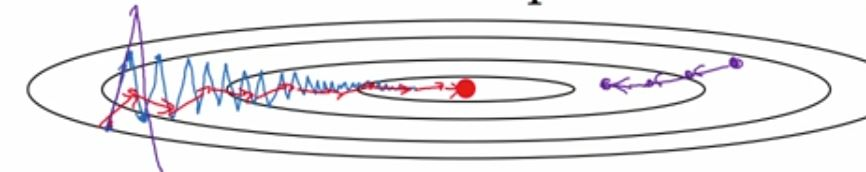

# 神经网络

## 关于python/numpy的向量建议

1. 当需要行向量或列向量时，不要使用秩为1的数组。若用了，则调用reshape()也行，但显然不够直接

   ```python
   a = np.random.randn(3) # a.shape = (5,) 秩为1的数组，它的行为可能不和预期一样
   print(a) # array([-0.51752973,  1.17089015,  0.56851099])
   # 如想要转置，实际上没有发生变化
   print(a.T) # array([-0.51752973,  1.17089015,  0.56851099])
   print(a * a.T) # array([0.26783703, 1.37098374, 0.32320475])，既不是数字，也不是矩阵
   """因此推荐使用行向量或列向量"""
   a = np.random.randn(3,1)
   print(a) # array([[ 1.21814546],[-0.51125614],[ 1.32058725]])
   print(a.T) # array([[ 1.21814546, -0.51125614,  1.32058725]])
   print(a * a.T) #array([[ 1.48387837, -0.62278435,  1.60866736],[-0.62278435,  0.26138284, -0.67515834],[ 1.60866736, -0.67515834,  1.74395068]])
   ```

2. numpy中的标识符keepdims

   ```python
   # 若设置为keepdims=True，则表示维持原来的维度
   
   ```

3. 

## 为什么要使用非线性激活函数？

如果使用线性激活函数，则神经网络的每个输出都是输入的线性组合，并不能有很强的能力。线性激活函数可用的地方有**输出层**（如果想预测房价，需要一个连续值）。补充，不同层可以使用不同的激活函数，如混合使用tanh, ReLU, leaky ReLU等。

## 激活函数的导数

$\sigma(z) = sigmoid(z)$，则$\sigma'(z) =  \sigma(z) (1-\sigma(z) )$

$\sigma(z) = tanh(z)$，则$\sigma'(z) = 1 - \sigma(z) ^2$

$\sigma(z) = ReLU(z)$，则$\sigma'(z) = \left\{ \begin{array}{ll} 0 & \mbox{if z < 0} \\ 1& \mbox{if z > 0} \end{array} \right.$

$\sigma(z) = Leaky ReLU(z)$，则$\sigma'(z) = \left\{ \begin{array}{ll} 0.01 & \mbox{if z < 0} \\ 1& \mbox{if z > 0} \end{array} \right.$

## 随机初始化

最好将权重初始化为非常小的数，如`np.random.randn(5)*0.01`，乘以常数0.01（或其他常数）来保证初始化值足够小，因为如果使用了sigmoid或tanh激活函数，权重如果较大会处于饱和状态从而导致学习慢。或者使用另一种方法，`np.random.randn(5)/sqrt(n_in)`。

## 向量化的反向传播

1. $dZ^L = dA^L \odot \sigma'(Z^L)$
2. $dA^{L-1} = (W^L)^T dZ^L$
3. $dB^L = \frac{1}{m} np.sum(dZ^L, axis=1, keepdim=True)$
4. $dW^L = \frac{1}{m} dZ^L (A^{L-1})^T$

## 训练集、验证集、测试集

一般是60%/20%/20%，但是若数据量超百万，则显然让验证集和测试集的数量只占1%也是合理的。

验证集和测试集必须来自同一分布，而训练集可以来自不同于验证集和测试集的分布。（如训练集来自网上的图片，验证集和测试集来自用户上传的图片）

**但是**，以如上的例子为例，如果训练集分布不同于验证集和测试集，则当训练集的误差和验证集的误差相差较大时，不能确定是修正方差问题还是因为两者的分布不同带来的问题。这时需要加入训练-验证集（从训练集中取出一部分作为训练-验证集）。另外，**如果训练样本足够多，则可将不用作训练的样本部分丢到训练样本中去**。

|             | 误差1 | 误差2 | 误差3 | 误差4 |
| ----------- | ----- | ----- | ----- | ----- |
| 贝叶斯误差  | 0%    | 0%    | 0%    | 0%    |
| 训练集      | 1%    | 1%    | 10%   | 10%   |
| 训练-验证集 | 9%    | 1.5%  | 11%   | 11%   |
| 验证集      | 10%   | 10%   | 12%   | 20%   |

对于误差1，原因是方差问题。对于误差2，原因是分布不同带来的问题。对于误差3，原因是偏差问题。对于误差4，原因是偏差和方差问题。

## dropout正则化

可分别对每层设置keep-prob，一次dropout具体做法如下

```python
# 假设位于第二层
d2 = np.random.rand(a2.shape[0], a2.shape[1]) < keep-prob # 决定哪些神经元将在此次中被dropout
a2 = np.multiply(a2, d2) # dropout
a2 /= keep-prob # 为不影响z^3的期望值，因为z^3 = w^3·a^2 + b^3，需要将w^3·a^2除以keep-prob
```

优点：防止过拟合

缺点：不能画出cost图像

## 梯度消失和爆炸问题

使用更好的权重初始化方法

## 梯度检验

将所有的参数组合成$\Theta$，即$J(w_1, b_1, ..., w_n, b_m) = J(\theta_1,\theta_2, ... , \theta_{2n - 1}, \theta_{2n})$

for each i:
$$
d\Theta_{approx}[i] = \frac{J(\theta_1, ... \theta_i + \epsilon, ...) - J(\theta_1, ..., \theta_{i}, ...)}{2\epsilon} \\
d\theta[i] = \frac{\partial J}{\partial \theta_i}
$$
检查$\frac{\|d\Theta_{approx}[i] - d\theta[i]\|_2}{\|d\Theta_{approx}\|_2 + \|d\theta\|_2} \approx  10^{-7}$，若在10^(-5)或更大，可能出现了bug

**注**：（待实践）

1. 调试过程，而不要在训练过程中开启，因为目的是解决bug
2. 当算法不能通过梯度检验，需要检查全部参数以找到bug点
3. 注意正则项。如果代价函数中包含正则项，需要考虑
4. 不要和dropout一起使用

## 归一化输入

当输入特征的取值范围有很大不同时，必须要归一化输入（均值为0，方差为1）以确保梯度下降算法运行良好。当输入特征的取值范围没有很大不同，不用归一化输入也可以。

## mini-batch size

典型的有：64，128，256，512

**注**：size要满足CPU/GPU的内存，若超过则性能会很糟糕

## 指数加权移动平均值

以温度为例子：365天每天的温度为$\theta_t$，设$v_t$为前一天的$\beta$倍加今天温度的$1-\beta$倍，则有
$$
v_t = \beta v_{t-1} + (1 - \beta) \theta_t
$$
$v_t$约等于$\frac{1}{1-\beta}$天的平均温度。若$\beta=0.9$表示10天的平均温度；$\beta=0.98$表示50天的平均温度；$\beta=0.5$表示2天的平均温度

### 偏差修正（可选）

初期用上述公式有明显的偏差（因为初期数据量不足，求10天的平均值但前面只有1天之类的），偏差修正即
$$
v_t = \frac{v_t}{1-\beta^t}
$$

## momentum梯度下降（比梯度下降运行的好）

对于每次循环，计算mini-batch 的dW、db
$$
\begin{array}{ll}
v_{dw} & = & \beta v_{dw} + (1-\beta)dW \\
v_{db} & = & \beta v_{db} + (1-\beta)db \\
W & = & W - \eta v_{dw}, b = b - \eta v_{db}
\end{array}
$$

### 直观理解

蓝色线为梯度下降，红色线为momentum梯度下降（纵轴上波动变小，横轴上加速靠近）



## RMSprop

和momentum类似

对于每次循环，计算mini-batch 的dW、db
$$
\begin{array}{ll}
s_{dw} & = & \beta s_{dw} + (1-\beta)dW^2 \\
s_{db} & = & \beta s_{db} + (1-\beta)db^2 \\
W & = & W - \eta \frac{dW}{\sqrt{s_{dw + \epsilon}}}, b = b - \eta \frac{db}{\sqrt{s_{db + \epsilon}}}
\end{array}
$$

## Adam

结合momentum和RMSprop

对于每次循环，计算mini-batch 的dW、db
$$
\begin{array}{ll}
v_{dw} & = & \beta_1 v_{dw} + (1-\beta_1)dW & ， &
v_{db} & = & \beta_1 v_{db} + (1-\beta_1)db \\
s_{dw} & = & \beta_2 s_{dw} + (1-\beta_2)dW^2 & ， &
s_{db} & = & \beta_2 s_{db} + (1-\beta_2)db^2 \\

v_{dw}^{corrected} & = & \frac{v_{dw}}{1-\beta_1^t} & ， &
v_{db}^{corrected} & = & \frac{v_{db}}{1-\beta_1^t} \\
s_{dw}^{corrected} & = & \frac{s_{dw}}{1-\beta_2^t} & ， &
s_{db}^{corrected} & = & \frac{s_{db}}{1-\beta_2^t} \\

W & = & W - \eta \frac{v_{dw}^{corrected}}{\sqrt{s_{dw}^{corrected} + \epsilon}} & , & b & = & b - \eta \frac{v_{dw}^{corrected}}{\sqrt{s_{db}^{corrected} + \epsilon}}
\end{array}
$$
根据作者推荐，缺省值：$\beta_1 = 0.9, \beta_2 = 0.999,  \epsilon = 10^{-8}$

## batch归一化

$\gamma和\beta$是待学习的参数，归一化原理如下
$$
\begin{array}{ll}
\mu & = & \frac{1}{m} \sum_i z^{(i)} \\
\sigma^2 & = & \frac{1}{m} \sum_i (z^{(i)} - \mu)^2 \\
z^{(i)}_{norm} & = & \frac{z^{(i)} - \mu}{\sqrt{\sigma^2 + \epsilon}} \\
\tilde{z}^{(i)} & = & \gamma z^{(i)}_{norm} + \beta
\end{array}
$$

可用指数加权移动平均值的方式计算$\mu、\sigma^2$（当一次性计算消耗大时）。测试过程中也需要$\mu、\sigma^2$，可用每次mini-batch过程中得到的$\mu、\sigma^2$来计算平均值


在深度学习中，$z=wx+b$，由于z要进行归一化，故b是可以省略的。

反向传播过程：
$$
w^l = w^l - \frac{\partial C}{\partial w^l} \\
\beta^l = \beta^l - \frac{\partial C}{\partial \beta^l} \\
\gamma^l = \gamma^l - \frac{\partial C}{\partial \gamma^l}
$$


batch归一化目的：当输入的分布不同时，减弱这份不同。因为不同的分布可能导致已训练好的网络精确度低。在隐藏层中使用batch归一化，可使前后层的依赖程度降低，学习更容易

如果使用batch归一化，要和mini-batch一同使用


## softmax

C表示类别数量，损失函数和代价函数分别为
$$
\begin{array}{ll}
L(\hat{y}, y) & = & - \sum_{j=1}^C y_i logy_i， \\
C & = & \frac{1}{m} \sum_{i=1}^{m} L(\hat{y}, y)
\end{array}
$$
这和手写体识别-神经网络中的笔记不一样


## 评估指标、优化指标、满足指标

*评估指标* 指精确度、准确率、召回率、F1等指标，用来评估算法的好坏

*优化指标* 指该算法想提升的方面，应尽可能提高

*满足指标* 指算法只需满足该指标即可，不超过该指标就能接受（算法的下限）


## 可避免偏差

训练误差相对于人类误差的差值即可避免误差。人类误差接近于贝叶斯误差，一般可用它近似。算法可超过人类误差，但不能超过贝叶斯误差。通过可避免偏差与（测试误差-训练误差）进行比较，推断应该解决偏差还是方差（可避免偏差大，解决偏差；可避免偏差小，解决方差）


## 误差分析

将分类错误的样本取出（假阳性、假阴性），统计这些样本占总样本的百分比，再根据精度，分析是否改善分类错误的算法有用，还是选用其他方法。例，识别猫的分类器，精度为90%，误差样本由分类成狗（8%）、猫科动物的动物（狮子、猎豹，21%）、图片模糊（40%）三个因素组成，分析每种因素带来的误差，选择处理图片模糊的或处理将猫科动物正确分类的方法，可以提高分类器的精度。


## 数据标注错误

数据标注错误若是随机产生的，则一般对深度学习结果没有影响。在误差分析过程中，还可以添加一列数据标注错误的因素，统计它的百分比，如果根据上面的方法确定数据标注错误带来的影响比较大，则需要进行数据标注的修改（此过程中要一起修改验证集和测试集的数据标注以保证**同一分布**）


## 迁移学习

最有用的场合：为优化任务B的性能，但B的数据量少，寻找**相关但不同**的任务A（数据量相对于B较多），因而能对B的训练有帮助。

how：如果B数据量少，则可将A中的网络输出层的前1到2层重新训练即可。如果重新训练所有参数，初期阶段也称为**预训练**；用A的数据预先训练权重，用B更新所有权重称为**微调**。


## 多任务学习

一个神经网络解决多个问题（可以识别是否有人、识别是否有车、识别是否有停车标志、识别是否有信号灯），一个足够大的神经网络比多个解决一个问题的神经网络性能要好。多任务学习要满足几个要求：1. 多个任务在低维度上共享特征； 2. 对于每个任务，它们的数据是相似的。


## 端到端学习

必须要有足够多的数据，才有可能要考虑。但也要和分步的学习做比较，确定哪种方式更容易学习。